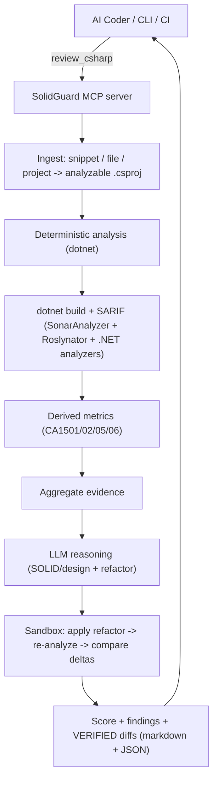

# SolidGuard MCP

An **agentic C#/.NET code-quality reviewer** exposed as a [Model Context Protocol](https://modelcontextprotocol.io) (MCP) server. AI coders (Cursor, Claude Code, Copilot) write C# fast, but quality is uneven: SOLID violations, high complexity, leaky abstractions, poor naming. SolidGuard plugs into the AI coding loop as a **tool** so the model can review what it just wrote, get evidence-backed feedback, and fix it — then re-verify the fix.

It is not another linter. It combines three layers:

1. **Deterministic Roslyn analysis** - real analyzer diagnostics (SonarAnalyzer.CSharp + Roslynator + .NET code-quality analyzers) and code metrics (cyclomatic complexity, coupling, maintainability). These are objective signals, not guesses.
2. **LLM design reasoning** - judges what linters can't: SRP/OCP/LSP/ISP/DIP adherence, abstraction smells, naming, error handling. Every finding is grounded in the deterministic evidence to reduce hallucination.
3. **Sandbox self-verification (the agentic part)** - each proposed refactor is applied in an isolated copy, recompiled, and re-analyzed. Only suggestions that **actually compile and measurably improve** the code are returned.

## Why not just ESLint / SonarQube?

| | Linters / SonarQube | SolidGuard |
| --- | --- | --- |
| Rule-based diagnostics | Yes | Yes (reuses them as evidence) |
| Reasons about SOLID/design intent | No | Yes (LLM) |
| Callable by an AI coder mid-task | No | Yes (MCP tool) |
| Proposes a fix | Partial | Yes, full-file refactor |
| **Proves the fix compiles & improves metrics** | No | **Yes (sandbox re-analysis)** |

## Architecture



## Tools

- **`review_csharp`** - full pipeline. Input: exactly one of `code`, `filePath`, or `projectPath` (+ optional `focus`, `includeSuggestions`). Returns a quality score, design findings, and sandbox-verified refactor diffs.
- **`get_metrics`** - deterministic metrics + analyzer diagnostics only. No LLM, no cost. Fast feedback.
- **`verify_patch`** - apply a proposed full-file replacement in a sandbox and report whether it compiles and how metrics/diagnostics changed. Use to validate a refactor before applying it.

## Prerequisites

- **Node.js >= 20**
- **.NET SDK 8 or 9** (`dotnet` on PATH). The first analysis restores analyzer NuGet packages, so network access is needed once.
- An LLM key only if you want the design-reasoning step (see below). The deterministic tools work without one.

## Install & build

```bash
npm install
npm run build
```

## Configure as an MCP server

### Cursor (`.cursor/mcp.json`)

```json
{
  "mcpServers": {
    "solidguard": {
      "command": "node",
      "args": ["C:/absolute/path/to/csharp-quality-mcp/dist/index.js"],
      "env": {
        "SG_LLM_PROVIDER": "openai",
        "SG_LLM_MODEL": "gpt-4o-mini",
        "SG_LLM_API_KEY": "sk-..."
      }
    }
  }
}
```

(See [`examples/cursor-mcp.json`](examples/cursor-mcp.json).) Claude Code uses the same shape via `claude mcp add`.

### LLM providers

Configure via environment (see [`.env.example`](.env.example)):

- **OpenAI**: `SG_LLM_PROVIDER=openai`, `SG_LLM_MODEL=gpt-4o-mini`, `SG_LLM_API_KEY=...`
- **Anthropic**: `SG_LLM_PROVIDER=anthropic`, `SG_LLM_MODEL=claude-3-5-sonnet-latest`, `SG_LLM_API_KEY=...`
- **Local (Ollama / LM Studio)**: `SG_LLM_PROVIDER=openai-compatible`, `SG_LLM_BASE_URL=http://localhost:11434/v1`, `SG_LLM_MODEL=qwen2.5-coder:7b`

If no key is configured, `review_csharp` still returns the full deterministic analysis and notes that reasoning was skipped.

## Example

Reviewing the deliberately bad [`test/fixtures/BadOrderService.cs`](test/fixtures/BadOrderService.cs) (an `OrderService` that prices, persists, notifies, and logs all in one high-complexity method):

`get_metrics` reports objective signals:

```
- Max cyclomatic complexity: 14
- Hotspots: ProcessOrder (complexity 14)
- [warning] CA1502 BadOrderService.cs:14 - 'ProcessOrder' has a cyclomatic complexity of '14'. ... reduce below '11'.
- [warning] S1104 BadOrderService.cs:12 - Make this field 'private' and encapsulate it in a 'public' property.
- [warning] S2325 - Make 'SendEmail' a static method.
- [info] RCS1058 - Use compound assignment
```

A proposed refactor (split pricing per type, encapsulate the field, make helpers static) is then **sandbox-verified**:

```
# verify_patch: VERIFIED (compiles, no regressions)
- Compiles: true
- Diagnostics: 11 -> 4
- Max complexity: 14 -> none over threshold
```

The diff is only surfaced because re-running Roslyn on it proved the improvement — not because the model claimed it.

## How verification decides

A suggestion is marked `verified` only if, after applying it in an isolated clone:

- the project still **compiles**, and
- it introduces **no new errors**, and
- **total diagnostics do not increase**, and
- **peak cyclomatic complexity does not increase**.

Otherwise it is returned as `NOT VERIFIED` with the reason, so the caller never blindly applies a regression.

## Scripts

```bash
npm run build       # compile TypeScript
npm test            # build + run unit tests (SARIF parsing, metric derivation, scoring)
node scripts/smoke.mjs         # connect over stdio and list tools
node scripts/try-metrics.mjs   # run get_metrics against a fixture
node scripts/try-pipeline.mjs  # no-LLM review + sandbox verify_patch demo
```

## Implementation notes & limitations

- **Snippets/files** are wrapped in a generated throwaway `.csproj` we control (analyzers + metric thresholds injected). **Projects/solutions** are analyzed in place.
- Analyzer messages are forced to English (`DOTNET_CLI_UI_LANGUAGE=en-US`) so they parse reliably regardless of machine locale.
- Per-member metrics are derived from the `.NET` code-metric analyzer diagnostics (CA1501/1502/1505/1506) rather than the `Microsoft.CodeAnalysis.Metrics` MSBuild target, which is currently broken on the .NET 9 SDK (emits an empty report).
- A single isolated snippet lacks project context, so findings that depend on missing types are reported with lower confidence.

## License

MIT - see [LICENSE](LICENSE).
